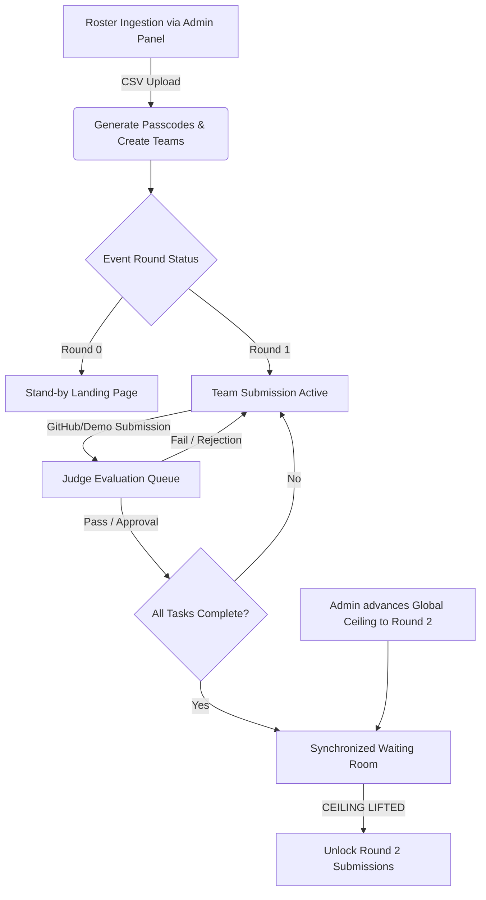

# ⚡ UNLOCK'D — IEEE RAS MUJ Hackathon Portal

Unlock'D is a role-based operations platform that manages **Unlock'D**, the 24-hour progressive software development challenge and CTF events organized by **IEEE Robotics & Automation Society (RAS), MUJ**. It drives progressive team progression, enables real-time scoring and multi-judge feedback, automates roster ingestion, and features an immersive glassmorphic dark-theme UI.

---

## 🚀 Tech Stack

| Layer | Technology | Key Modules & Usage |
| :--- | :--- | :--- |
| **Framework** | Next.js 16 (App Router) | Server Components, Route Handlers, Turbopack |
| **Database** | PostgreSQL (Neon / Supabase) | Serverless via connection pooling |
| **ORM** | Prisma ORM | Schema migrations, type-safe queries |
| **API Architecture** | tRPC (v11) + REST | End-to-end type safety, React Query |
| **Styling** | Tailwind CSS + CSS Modules | Glassmorphism UI, fluid layouts |
| **Animations & 3D** | Framer Motion + Spline 3D | Micro-interactions, 3D robots |
| **Authentication** | Custom Session Tokens & JWTs | PBKDF2 hashing, AES-256-GCM cookies |
| **Components** | Radix UI + Base UI + Lucide | Sliders, dropdowns, accessible primitives |

---

## 🗺️ Architecture & Event Lifecycle

Unlock'D runs on a **Progressive Hackathon Roadmap Engine**.



### Progressive State Engine
- **Round 0 (Setup)**: Submissions disabled. Teams see a stand-by page.
- **Round 1+ (Sprints)**: Teams submit tasks with GitHub URL, demo URL, and descriptions.
- **Synchronized Waiting Room**: Teams that finish all milestones wait until the admin advances the global round ceiling.

### Multi-Judge Grading
- Real-time dashboard ordered chronologically with a time-ago counter.
- Judges grade across **7 criteria** (max 100) using Base UI Sliders.
- Consolidated multi-judge feedback and live leaderboards.

---

## 🔒 Security

- **Rate Limiting**: Sliding window — max 5 login requests/min/IP on auth routes.
- **PBKDF2 Hashing**: 600,000 iterations (HMAC-SHA512) with unique salts.
- **AES-256-GCM**: Staff session tokens encrypted via `NEXTAUTH_SECRET`.
- **Timing Attack Defenses**: `crypto.timingSafeEqual` for password comparison.
- **HTTP-Only Cookies**: JWTs and session UUIDs via Secure, SameSite cookies.

---

## 💻 Local Setup

### Prerequisites
- Node.js 18+
- PostgreSQL instance (local or Neon/Supabase)

### Installation

```bash
npm install
```

### Database

```bash
npx prisma db push
npm run db:seed
```

### Development

```bash
npm run dev
```

Open `http://localhost:3000`.

---

## 📁 Project Structure

```
src/
├── app/            # App Router: admin, api, dashboard, judging
├── components/     # Navbar, layouts, SplineRobot 3D canvas
├── lib/            # auth-utils, csv-parser, state-engine
├── server/         # tRPC routers, db client, middleware
└── proxy.ts        # Rate limiting middleware
```

### Team Roster CSV Format (For Ingestion)

```csv
Team Id,Team Name,Email
unstop_101,CyberTitans,cyber.titans@test.com
unstop_102,DeltaForce,delta.force@test.com
```

Passcodes are generated once and shown as plain text upon successful upload.
