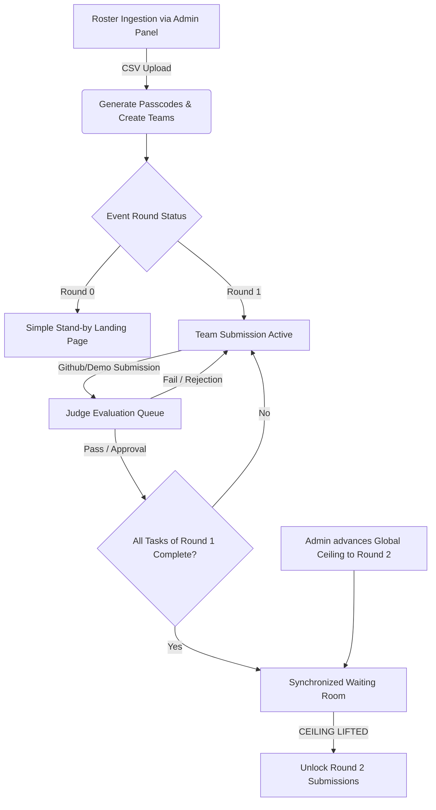

# ⚡ UNLOCK'D — IEEE RAS MUJ Hackathon & CTF Portal

Unlock'D is a state-of-the-art, role-based operations platform designed to coordinate and manage **Unlock'D**, the 24-hour progressive software development challenge and Capture the Flag (CTF) events organized by the **IEEE Robotics & Automation Society (RAS), MUJ**.

The platform drives progressive team progression, enables real-time scoring and multi-judge feedback, automates roster ingestion, and features an immersive, glassmorphic dark-theme user experience.

---

## 🚀 Tech Stack

| Layer | Technology | Key Modules & Usage |
| :--- | :--- | :--- |
| **Framework** | Next.js 16 (App Router) | Native Server Components, Route Handlers, Turbopack |
| **Database** | PostgreSQL (Neon / Supabase) | Managed serverless database via connection pooling |
| **ORM** | Prisma ORM | Automated schema migrations, client generation, type-safe queries |
| **API Architecture** | tRPC (v11) + REST | End-to-end type safety, React Query integration |
| **Styling** | Tailwind CSS + CSS Modules | Glassmorphism UI components, fluid layouts |
| **Animations & 3D** | Framer Motion + Spline 3D | Micro-interactions, dynamic state transitions, 3D interactive robots |
| **Authentication** | Custom Session Tokens & JWTs | Timing-safe PBKDF2 hashing, AES-256-GCM cookie security |
| **Components** | Radix UI + Base UI + Lucide | Headless sliders, dropdowns, accessible primitives, icons |

---

## 🗺️ Architectural Concept & Event Lifecycle

Unlock'D operates on a **Progressive Hackathon Roadmap Engine** managed via an Event configuration payload.



### 1. Progressive State Engine & The Global Ceiling
- Submissions are evaluated sequentially based on a configurable event roadmap.
- **Round 0 (Setup Phase)**: Submissions are disabled. Teams log in to see a simple, glassmorphic stand-by landing page reminding them to wait for start-time.
- **Round 1+ (Sprints)**: Teams submit tasks (`FEATURE-1`, `FEATURE-2`, etc.) by providing a valid GitHub URL, live demo URL, and descriptions.
- **Synchronized Waiting Room**: If a team finishes all milestones of their allowed round, they enter a waiting room. They cannot submit the next round's features until the Administrator advances the event's global round ceiling.

### 2. Multi-Judge Grading Queue
- Real-time dashboard showing incoming submissions ordered chronologically with a time-ago counter.
- Evaluators grade projects across **7 distinct criteria** (max score 100) using Base UI Slider controls.
- Calculated metrics: Average scores, consolidated multi-judge feedback string, and global live leaderboards.

---

## 🗄️ Database Schema & Data Models

Prisma represents the database layer in [`prisma/schema.prisma`](file:///c:/Users/sriva/Desktop/UnlockD_Portal/prisma/schema.prisma):

```
+---------------+        +---------------+
|     User      |--------|  Evaluation   |
| (Admin/Judge) |        | (Grades/Feedb)|
+---------------+        +---------------+
                                |
                                |
+---------------+        +---------------+
|     Event     |--------|  Submission   |
| (Hackathon/CF)|        | (Pending/Appr)|
+---------------+        +---------------+
        |                       |
        |                       |
+---------------+        +---------------+
| Registration  |--------|    Session    |
|    (Team)     |        | (UUID Expiry) |
+---------------+        +---------------+
```

### Model Definitions
1. **`User`**: Admin and Judge staff credentials containing `username`, `passwordHash`, and `systemRole` (`'ADMIN'` or `'JUDGE'`).
2. **`Event`**: Specific hackathon or CTF configuration containing `slug`, `name`, `eventType`, `currentGlobalRound`, and a JSONB `config` storing stages, roadmap steps, passing thresholds, and rubrics.
3. **`Registration`**: Participant teams containing `eventId`, `unstopTeamId`, `teamName`, `teamPasscodeHash`, `progressState` (tracks stage, cumulative points, dynamic status), and `totalScore`.
4. **`Submission`**: Links a team to a task (`taskId`, `roundNumber`, `payload` JSON containing URLs, status `'PENDING' | 'APPROVED' | 'REJECTED'`).
5. **`Evaluation`**: Score breakdown (`scoreBreakdown` JSONB), `totalScore`, and judge comments mapped to a submission.
6. **`Session`**: Session cookie validation model mapping team tokens (`uuid` ID) to registrations with expirations.

---

## 🔒 Security Architecture

Unlock'D implements enterprise-grade, low-dependency security paradigms:

*   **Rate Limiting**: Sliding window rate-limiting middleware (`src/proxy.ts`) enforces a maximum of **5 login requests per minute per IP** on team and staff auth routes.
*   **PBKDF2 Hashing**: Passwords and passcodes are hashed with PBKDF2 using a unique salt and **600,000 iterations** (HMAC-SHA512) to prevent brute-force attacks.
*   **AES-256-GCM Session Cryptography**: Staff session tokens are encrypted using AES-256-GCM authenticated encryption derived from the `NEXTAUTH_SECRET` value.
*   **Timing Attack Defenses**: Hashed password comparisons use Node's `crypto.timingSafeEqual` comparison mechanism to secure login routes.
*   **HTTP-Only Cookies**: JWTs and session UUIDs are delivered via HTTP-Only, Secure, SameSite cookies to mitigate XSS and session hijacking vectors.

---

## 📁 Workspace Directory Structure

```text
UnlockD_Portal/
├── prisma/
│   ├── schema.prisma       # Database modeling (Postgres/Neon)
│   └── seed.ts             # Dev seeding script (Admin, Judges, Events)
├── src/
│   ├── app/                # Next.js App Router folders
│   │   ├── admin/          # Admin Overview, applications, import tool
│   │   ├── api/            # API Route Handlers (Auth, grading, leaderboard)
│   │   ├── dashboard/      # Team Workspace (Round 0 / Submission Form / Waiting Room)
│   │   ├── judging/        # Evaluation board & Criteria Sliders
│   │   ├── page.tsx        # Homepage overview, timeline, criteria
│   │   ├── schedule/       # Day 1 & Day 2 Schedule page
│   │   └── globals.css     # Design tokens, custom glassmorphism layers
│   ├── components/         # Reusable layouts, Navbar, SplineRobot 3D canvas
│   ├── lib/
│   │   ├── auth-utils.ts   # Crypto helpers, PBKDF2, AES-256 tokens
│   │   ├── csv-parser.ts   # RFC 4180-compliant Unstop CSV parser
│   │   └── state-engine.ts # Progressive Roadmap rule generator
│   ├── server/             # tRPC Router definitions
│   │   ├── routers/        # Sub-routers (teams, judging, application)
│   │   ├── db.ts           # Global Prisma Client instance
│   │   └── trpc.ts         # tRPC initialization, middleware (isAdmin, isTeam)
│   └── proxy.ts            # Rate limiting and route protection middleware
├── .env.example            # Blueprint configuration file
├── tailwind.config.js      # Custom animations and core layouts
└── package.json            # Scripts & project dependencies
```

---

## ⚙️ Environment Configuration

Copy `.env.example` to create your local variables configuration file:

```bash
cp .env.example .env
```

Define the following environment variables:

| Variable | Required | Description |
| :--- | :--- | :--- |
| `DATABASE_URL` | Yes | PostgreSQL transaction connection string. (e.g., Neon Pooler URL with `pgbouncer=true`). |
| `DIRECT_URL` | Yes | PostgreSQL session connection string. (Used for direct migrations & schema pushes). |
| `NEXTAUTH_URL` | Yes | Host url of the server (e.g. `http://localhost:3000`). |
| `NEXTAUTH_SECRET` | Yes | Secret string used for AES key derivation. (Generate with `openssl rand -base64 32`). |
| `GOOGLE_CLIENT_ID` / `_SECRET` | No | Credentials for Google Single Sign-on integration. |
| `GITHUB_CLIENT_ID` / `_SECRET` | No | Credentials for Github Developer authorization. |
| `RESEND_API_KEY` | No | Resend mail client integration key. |
| `EMAIL_FROM` | No | Verified sending email domain address. |
| `AWS_ACCESS_KEY_ID` / `_SECRET` | No | File upload client authentication keys. |
| `AWS_REGION` / `AWS_S3_BUCKET` | No | Cloud storage endpoint and destination bucket. |
| `NEXT_PUBLIC_POSTHOG_KEY` / `_HOST` | No | Telemetry & event tracking analytics variables. |

---

## 💻 Local Quickstart

### Prerequisites
- Node.js 18.x or later installed
- A running PostgreSQL instance (or Neon database cloud cluster)

### 1. Installation
Install dependencies:
```bash
npm install
```

### 2. Prepare Database
Push schema definition to database and seed sample events & roles:
```bash
npx prisma db push
npm run db:seed
```

### 3. Start Development Server
Launch server with Next.js Turbopack active:
```bash
npm run dev
```
Open `http://localhost:3000` to review the dashboard.

---

## 📋 Default Test Credentials

Seeding the database creates the following administrator and judging staff accounts:

*   **Administrator Account**:
    *   **Username**: `admin`
    *   **Password**: `admin123`
*   **Judge Account**:
    *   **Username**: `judge`
    *   **Password**: `judge123`

### Team Roster CSV Format (For Ingestion)
To import participant data in `/admin/import`, upload a CSV matching this structure:
```csv
Team Id,Team Name,Email
unstop_101,CyberTitans,cyber.titans@test.com
unstop_102,DeltaForce,delta.force@test.com
```
*Passcodes will be generated and shown as plain text only once upon a successful upload.*


